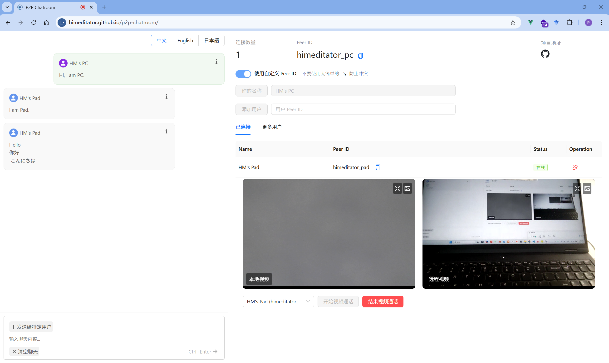

<div align="center" >
    
    <h1>P2P Chatroom</h1>
    <p>一个基于 WebRTC 和 PeerJS 的 P2P 简单聊天网页，支持文本聊天和视频通话功能。</p>
    <p>
        | <b>简体中文</b>
        | <a href="./README_en.md">English</a>
        | <a href="./README_ja.md">日本語</a> |
    </p>
</div>



## 🌐 在线访问

访问 [p2p-chatroom](https://himeditator.github.io/p2p-chatroom/) 体验应用。

## ✨ 特性

- 实时文本聊天
- 实时视频通话
- 简洁的用户界面
- P2P 连接，无需中央服务器
- 支持中文、英语和日语界面语言切换

## 📚 基本使用

1. 在左边聊天界面的右上角可以切换语言。
2. Peer ID 是与其他用户通信的唯一凭证，可以自定义 Peer ID，也可以由系统生成。
3. 获得 Peer ID 之前需要指定一个用户名，在确认用户名后即可获得 Peer ID。
4. 输入你想连接的用户的 Peer ID，点击按钮添加对应用户。
5. 在“更多用户”列表中，你可找到你连接的用户连接的其他用户。
6. 添加用户成功后，即可开始进行文字和视频聊天了。

## 🚀 项目运行

```bash
# 安装依赖
npm install

# 启动开发服务器
npm run dev

# 构建生产版本
npm run build
```

