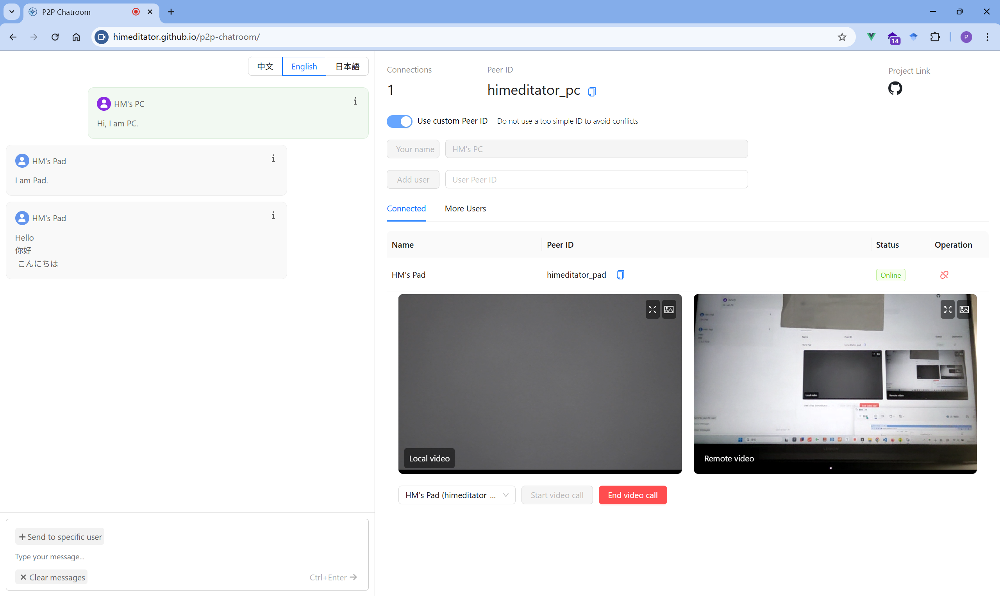

<div align="center" >
    
    <h1>P2P Chatroom</h1>
    <p>A simple P2P chat webpage based on WebRTC and PeerJS, supporting text chat and video call features.</p>
    <p>
        | <a href="./README.md">简体中文</a>
        | <b>English</b>
        | <a href="./README_ja.md">日本語</a> |
    </p>
</div>



## 🌐 Online Access

Visit [p2p-chatroot](https://himeditator.github.io/p2p-chatroom/) to experience the application.

## ✨ Features

- Real-time text chat
- Real-time video calls
- Simple and clean user interface
- P2P connection, no central server required
- Support for Chinese, English, and Japanese language switching

## 📚 Basic Usage

1. You can switch languages in the top right corner of the left chat interface.
2. The Peer ID is a unique identifier for communication with other users. You can customize your Peer ID or have it generated by the system.
3. Before obtaining a Peer ID, you need to specify a username. After confirming the username, you will receive a Peer ID.
4. Enter the Peer ID of the user you want to connect to and click the button to add the corresponding user.
5. In the "More Users" list, you can find other users connected to the user you are connected to.
6. Once you successfully add a user, you can start text and video chats.

## 🚀 Project Setup

```bash
# Install dependencies
npm install

# Start the development server
npm run dev

# Build the production version
npm run build
```