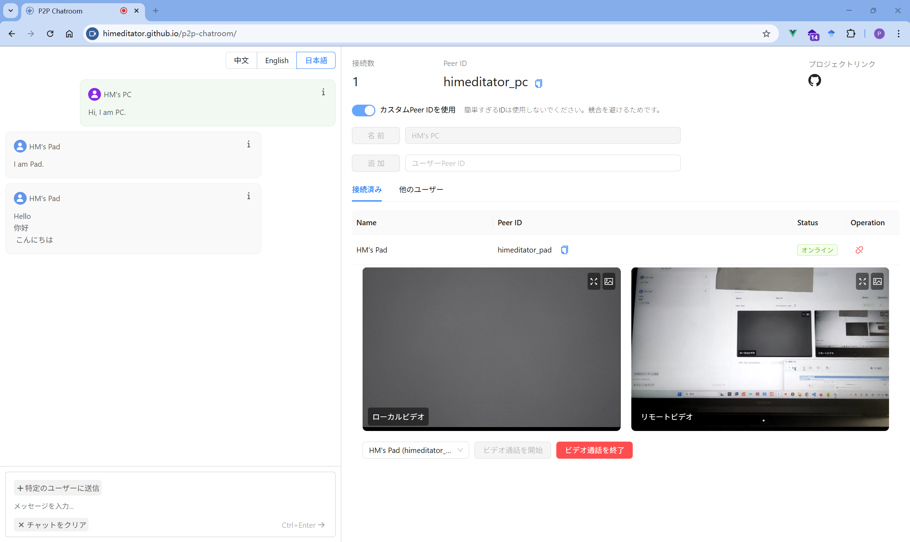

<div align="center" >
    
    <h1>P2P Chatroom</h1>
    <p>WebRTC と PeerJS を基にした P2P のシンプルなチャットウェブページで、テキストチャットとビデオ通話機能をサポートしています。</p>
    <p>
        | <a href="./README.md">简体中文</a>
        | <a href="./README_en.md">English</a>
        | <b>日本語</b> |
    </p>
</div>



## 🌐 オンラインアクセス

[p2p-chatroom](https://himeditator.github.io/p2p-chatroom/) にアクセスしてアプリケーションを体験してください。

## ✨ 特徴

- リアルタイムのテキストチャット
- リアルタイムのビデオ通話
- シンプルでクリーンなユーザーインターフェース
- P2P 接続、中央サーバー不要
- 中国語、英語、日本語の言語切り替えをサポート

## 📚 基本的な使用方法

1. 左側のチャットインターフェースの右上隅で言語を切り替えることができます。
2. Peer ID は他のユーザーとの通信に必要な唯一の識別子です。自分でカスタマイズすることも、システムが生成することもできます。
3. Peer ID を取得する前にユーザーネームを指定する必要があります。ユーザーネームを確認すると Peer ID が発行されます。
4. 接続したいユーザーの Peer ID を入力し、ボタンをクリックして対応するユーザーを追加します。
5. 「他のユーザー」リストでは、接続しているユーザーが接続している他のユーザーを見つけることができます。
6. ユーザーの追加が成功したら、テキストチャットとビデオ通話を開始することができます。

## 🚀 プロジェクトの実行

```bash
# 依存関係のインストール
npm install

# 開発サーバーの起動
npm run dev

# プロダクション版のビルド
npm run build
```